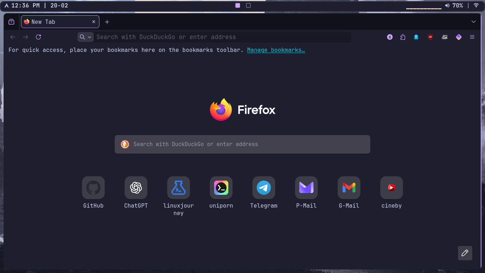
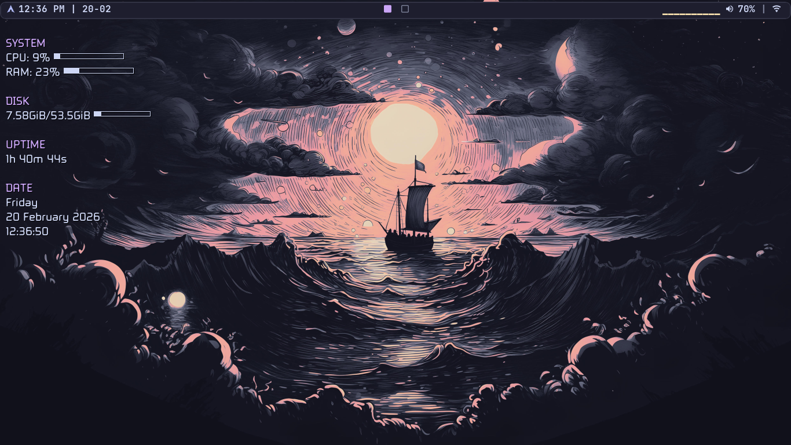
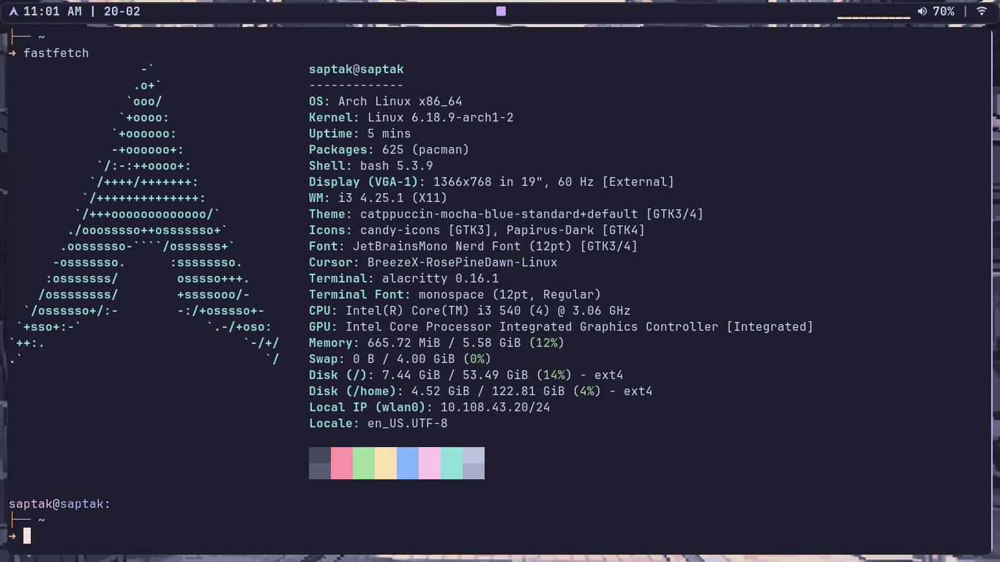
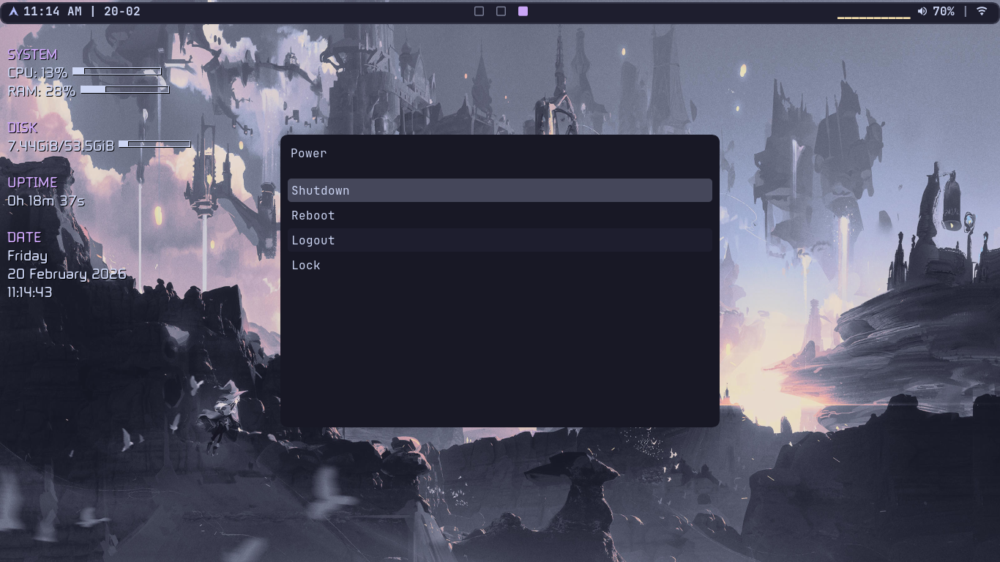
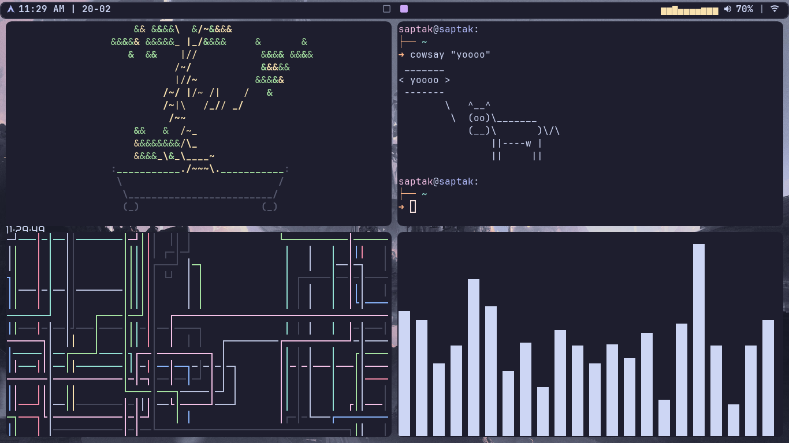
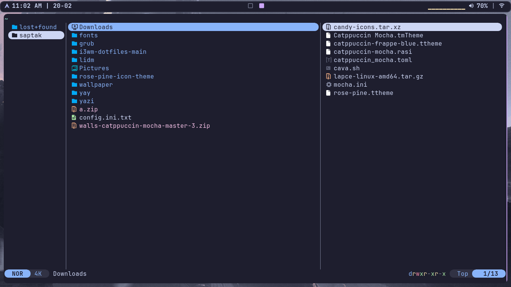

# Catppuccin Mocha i3 Setup🌿

## Now under development(shifting to eww)
### dropped eww just use polybar for now

## OS:arch (will work with other too)

## Dependencies🧩

- **alacritty** 
- **cava**
- **conky** 
- **dunst**
- **flameshot**
- **helix**
- **i3**
- **picom**
- **polybar**
- **rofi**
- **yazi** 


> All color palette is taken from official catppuccin mocha website no editing has been done!🎨

## Browser-Firefox🌐
> To get firefox theme browse in firefox theme and extension



## Desktop📺

 

## Fastfetch💻



## Rofi-Powermenu🔃



## Rofi


## Terminal-Look



## yazi



> others images?? I am lazy to show :(

## Installation🔓

```bash
git clone https://github.com/saptak119/catppuccin-mocha-i3.git
```

*Copy all files to there desired folder*

That's it enjoy😄 
